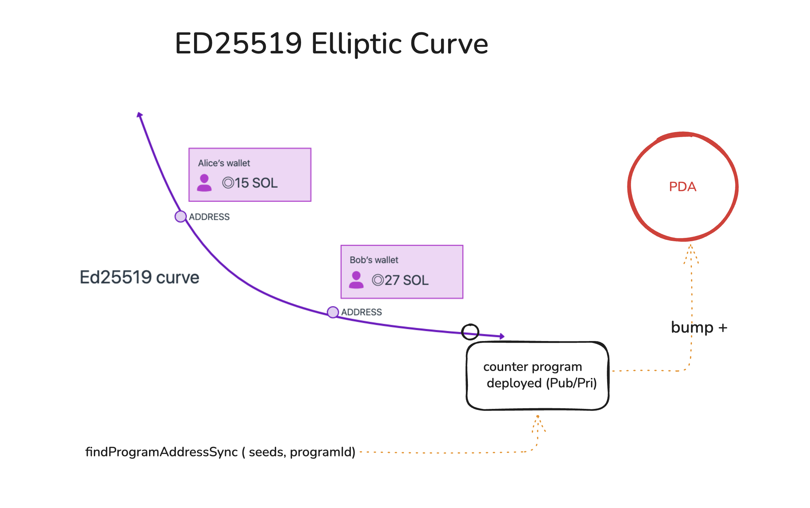

# Program Derived Address (PDA)



A comprehensive reference repository demonstrating **Program Derived Addresses (PDAs)** in Solana across multiple programming languages and frameworks. This project provides practical examples and implementations for understanding and working with PDAs in Solana development.

## What is a Program Derived Address (PDA)?

A **Program Derived Address (PDA)** is a deterministic address derived from a program ID and a set of seeds, without requiring a private key. Unlike traditional Solana accounts that require keypairs for signing, PDAs are owned by programs and can only be signed for by the program that owns them.

### Key Concepts

- **Deterministic**: The same seeds and program ID always produce the same PDA address
- **Program-Owned**: PDAs are owned by the program that derives them, not by any user keypair
- **Seed-Based**: Derived from a combination of seeds (strings, pubkeys, or other data) and the program ID
- **Bump Seed**: A single-byte value (0-255) used to ensure the PDA is off the ed25519 curve, making it invalid for traditional signing

### Why Use PDAs?

PDAs enable programs to:

- **Create accounts deterministically** without requiring users to provide account addresses
- **Sign transactions** on behalf of the PDA account
- **Store program state** in accounts that the program can control
- **Implement cross-program invocations** with proper authorization

## Project Structure

This repository contains multiple implementations demonstrating PDA derivation and usage:

```
pda/
├── pda-anchor/          # Anchor framework implementation
│   ├── programs/       # Solana program written in Rust using Anchor
│   ├── tests/          # Anchor test suite
│   └── migrations/     # Deployment scripts
├── pda-rust/           # Standalone Rust implementation
│   └── src/main.rs     # Rust script using solana-sdk
└── pda-ts/             # TypeScript implementations
    ├── index.ts        # Using @solana/web3.js
    └── index-kit.ts    # Using @solana/kit
```

## Implementation Examples

### 1. Anchor Framework (Recommended for Production)

The `pda-anchor` directory contains a complete Anchor program that demonstrates PDA initialization and management.

**Program Code** (`pda-anchor/programs/pda-rs/src/lib.rs`):

```rust
use anchor_lang::prelude::*;

#[program]
pub mod pda_account {
    use super::*;

    pub fn initialize(ctx: Context<Initialize>) -> Result<()> {
        let account_data = &mut ctx.accounts.pda;
        account_data.user = *ctx.accounts.user.key;
        account_data.bump = ctx.bumps.pda;
        Ok(())
    }
}

#[derive(Accounts)]
pub struct Initialize<'info> {
    #[account(mut)]
    pub user: Signer<'info>,

    #[account(
        init,
        seeds = [b"solwarrior", user.key().as_ref()],
        bump,
        payer = user,
        space = 8 + DataAccount::INIT_SPACE
    )]
    pub pda: Account<'info, DataAccount>,

    pub system_program: Program<'info, System>,
}

#[account]
#[derive(InitSpace)]
pub struct DataAccount {
    pub user: Pubkey,
    pub bump: u8,
}
```

**Key Features:**

- Uses Anchor's `seeds` attribute to automatically derive the PDA
- The `bump` attribute handles bump seed derivation automatically
- `init` attribute creates the account if it doesn't exist
- `space` defines the account size requirements

**Testing** (`pda-anchor/tests/pda-rs.ts`):

```typescript
import * as anchor from "@coral-xyz/anchor";
import { PublicKey } from "@solana/web3.js";

// Derive PDA on the client side
const [PDA] = PublicKey.findProgramAddressSync(
  [Buffer.from("solwarrior"), user.publicKey.toBuffer()],
  program.programId
);

// Initialize the PDA account
await program.methods
  .initialize()
  .accounts({
    user: user.publicKey,
  })
  .rpc();
```

### 2. TypeScript with @solana/web3.js

**Implementation** (`pda-ts/index.ts`):

```typescript
import { PublicKey } from "@solana/web3.js";

const programId = new PublicKey("11111111111111111111111111111111");
const seed = "solwarrior";
const userPubkey = new PublicKey(
  "BQuvWWJmjhS2X4jc6G9T2meEHdyzY6RsooTHLMABKeah"
);

// Derive PDA synchronously
const [pda, bump] = PublicKey.findProgramAddressSync(
  [Buffer.from(seed), userPubkey.toBuffer()],
  programId
);

console.log("PDA:", pda.toBase58());
console.log("Bump:", bump);
```

**Manual Bump Finding** (for reference):

```typescript
// If you need to find bump manually (from 255 down to 0)
for (let bump = 255; bump >= 0; bump--) {
  try {
    const pda = PublicKey.createProgramAddressSync(
      [Buffer.from(seed), Buffer.from([bump])],
      programId
    );
    console.log("Bump:", bump, "PDA:", pda.toBase58());
    break;
  } catch (error) {
    // Invalid point on curve, try next bump
  }
}
```

### 3. TypeScript with @solana/kit

**Modern Implementation** (`pda-ts/index-kit.ts`):

```typescript
import {
  type Address,
  getAddressEncoder,
  getProgramDerivedAddress,
} from "@solana/kit";

const programId = "11111111111111111111111111111111" as Address;
const userAddress = "BQuvWWJmjhS2X4jc6G9T2meEHdyzY6RsooTHLMABKeah" as Address;

const encoder = getAddressEncoder();
const userBuffer = encoder.encode(userAddress);
const seeds = ["solwarrior", userBuffer];

const [pda, bump] = await getProgramDerivedAddress({
  programAddress: programId,
  seeds,
});

console.log("PDA:", pda);
console.log("Bump:", bump);
```

### 4. Rust Standalone Implementation

**Implementation** (`pda-rust/src/main.rs`):

```rust
use solana_sdk::pubkey::Pubkey;
use std::str::FromStr;

fn main() -> anyhow::Result<()> {
    let program_id = Pubkey::from_str("11111111111111111111111111111111")?;
    let seed = b"solwarrior";
    let user_pubkey = Pubkey::from_str("BQuvWWJmjhS2X4jc6G9T2meEHdyzY6RsooTHLMABKeah")?;

    // Find program address (automatically finds valid bump)
    let (pda, bump) = Pubkey::find_program_address(
        &[seed, user_pubkey.as_ref()],
        &program_id,
    );

    println!("Bump: {}, PDA: {}", bump, pda);
    Ok(())
}
```

## How PDA Derivation Works

1. **Seed Selection**: Choose seeds that uniquely identify your account (e.g., a string identifier and user's public key)

2. **Bump Finding**: Start with bump = 255 and work downwards:

   - Combine seeds + [bump] + program_id
   - Hash with SHA-256
   - Check if result is on the ed25519 curve
   - If not, use this bump; if yes, try next bump

3. **PDA Creation**: The PDA is the hash result that falls off the ed25519 curve

4. **Verification**: Always use the same seeds and bump to derive the same PDA

## Common Use Cases

- **User Profiles**: Store user-specific data in PDAs derived from user pubkey + program
- **Vaults**: Create deterministic vault addresses for token storage
- **State Management**: Store program state in accounts that programs can control
- **Cross-Program Invocation**: Enable programs to sign transactions for PDAs they own

## Getting Started

### Prerequisites

- **Rust**: For Anchor and Rust implementations
- **Node.js** (v16+): For TypeScript examples
- **Solana CLI**: For deploying programs
- **Anchor**: For Anchor framework examples

### Setup

#### Anchor Project

```bash
cd pda-anchor
yarn install
anchor build
anchor test
```

#### TypeScript Examples

```bash
cd pda-ts
npm install
npx ts-node index.ts
# or
npx ts-node index-kit.ts
```

#### Rust Standalone

```bash
cd pda-rust
cargo run
```

## Seed Design Best Practices

1. **Use Meaningful Seeds**: Choose descriptive strings (e.g., "vault", "user-profile")
2. **Include Context**: Combine multiple seeds when needed (e.g., user pubkey + counter)
3. **Be Consistent**: Always use the same seed format across your program
4. **Document Seeds**: Clearly document seed formats in your program's documentation

## Important Notes

- **Bump Storage**: Always store the bump seed in your account data to verify PDA derivation
- **Seed Order Matters**: Changing seed order produces different PDAs
- **Case Sensitivity**: Seed strings are case-sensitive
- **Account Ownership**: PDAs must be owned by the program that derives them

## Resources

- [Solana Program Derived Addresses Documentation](https://docs.solana.com/developing/programming-model/calling-between-programs#program-derived-addresses)
- [Anchor Documentation](https://www.anchor-lang.com/)
- [Solana Cookbook - PDAs](https://solanacookbook.com/references/accounts.html#create-a-program-derived-address)

## License

ISC

---

**Contributor**: This repository serves as a comprehensive reference for understanding and implementing PDAs in Solana development. Each implementation demonstrates different approaches and use cases for Program Derived Addresses.
